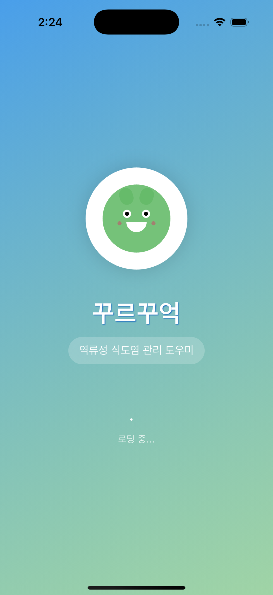
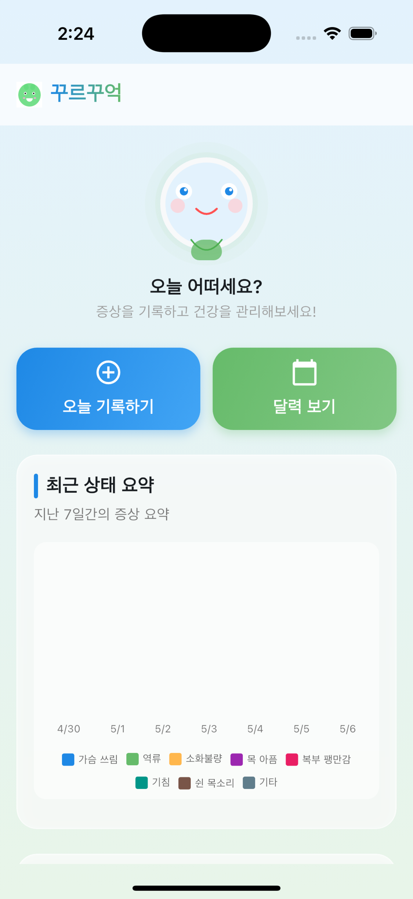
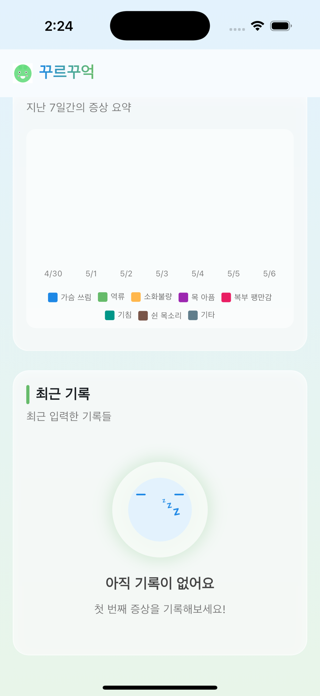
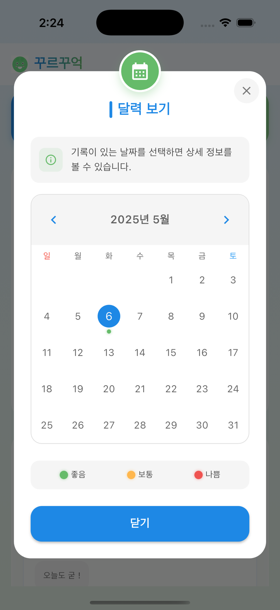
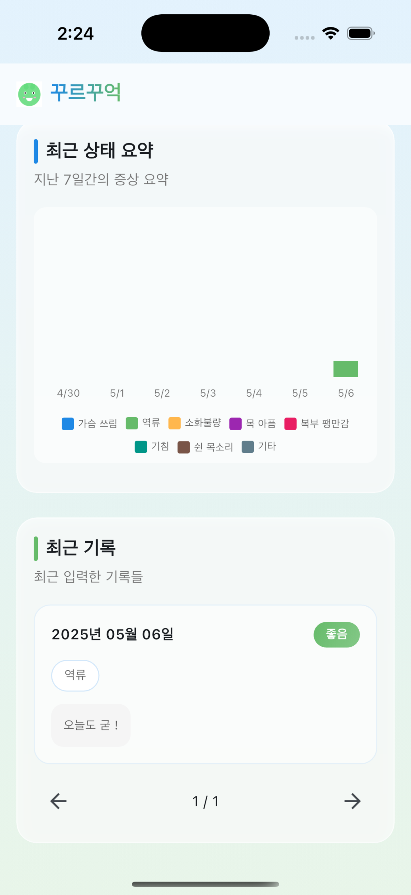
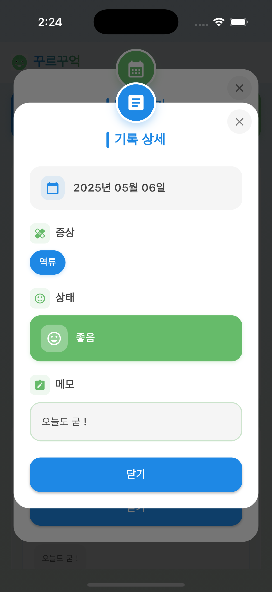
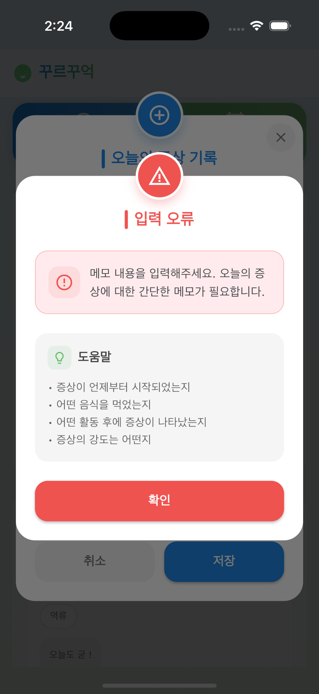

# 🩺 꾸르꾸억 (NoGERD)

<div align="center">

**역류성 식도염 증상 기록 관리 앱**

[](https://apps.apple.com/us/app/꾸르꾸억/id6745237684)
[](https://github.com/pyowonsik/NoGERD)

**개발 기간**: 2025.04 | **출시**: App Store

</div>

---

## 📑 목차

- [📱 스크린샷](#-스크린샷)
- [🛠 기술 스택](#-기술-스택)
- [💡 프로젝트 소개](#-프로젝트-소개)
- [🏗️ 아키텍처](#️-아키텍처)
- [✨ 주요 기능](#-주요-기능)
- [🔥 주요 구현](#-주요-구현)
- [🎨 UI/UX](#-uiux)
- [💭 후기](#-후기)

---

## 📱 스크린샷

<p align="center">
  
  
  
</p>

<p align="center">
  
  
  
</p>

<p align="center">
  
</p>

---

## 🛠 기술 스택

### Language & Framework

 

### Architecture & State Management

  

### Data & Storage

 

### Libraries

 

---

## 💡 프로젝트 소개

**꾸르꾸억(NoGERD)**는 역류성 식도염 환자들이 일상 속 증상을 쉽게 기록하고 관리할 수 있도록 돕는 모바일 애플리케이션입니다.

### 기술 선택

| 기술                   | 선택 이유                        |
| ---------------------- | -------------------------------- |
| **Clean Architecture** | 레이어별 책임 분리, 확장성 확보  |
| **GetIt + RxDart**     | Reactive 상태 관리 + DI          |
| **Hive**               | 빠른 로컬 DB, 오프라인 완벽 지원 |
| **Freezed**            | 불변 모델 + 보일러플레이트 제거  |
| **Glass Morphism**     | 현대적 UI 트렌드                 |

---

## 🏗️ 아키텍처

### Clean Architecture

```
Presentation (UI)
      ↓
Domain (UseCase)
      ↓
Data (Repository → Hive)
```

### 패키지 구조

```
lib/
├── features/gerd_record/
│   ├── data/              # Hive Model, DataSource, RepositoryImpl
│   ├── domain/            # Entity, Repository Interface, UseCase
│   └── presentation/      # Screen, ViewModel, Widget
├── utils/                 # 유틸리티
├── injection.dart         # GetIt DI
└── main.dart
```

---

## ✨ 주요 기능

### 증상 기록

- **8가지 증상 선택**: 가슴 쓰림, 역류, 소화불량, 목 아픔, 복부 팽만감, 기침, 쉰 목소리, 기타
- **상태 평가**: 좋음 / 보통 / 나쁨
- **메모**: 상세 기록 (최대 300자)

### 통계 시각화

- **7일 차트**: 증상 빈도 추이
- **증상별 색상 구분**: 직관적 파악

### 기록 조회

- **페이지네이션**: 3개씩 표시
- **달력 뷰**: 월별 기록 현황
- **상세 보기**: 전체 정보 확인

### 데이터 관리

- **로컬 저장**: Hive Database
- **오프라인 지원**: 네트워크 불필요

---

## 🔥 주요 구현

### 1. Clean Architecture

```dart
// Domain Entity (Freezed)
@freezed
class GerdRecord with _$GerdRecord {
  const factory GerdRecord({
    required String date,
    required List<String> symptoms,
    required String status,
    required String notes,
  }) = _GerdRecord;
}

// Repository Interface
abstract class GerdRecordRepository {
  Future<List<GerdRecord>> getAllRecords();
  Future<void> addRecord(GerdRecord record);
}

// Repository Implementation
class GerdRecordRepositoryImpl implements GerdRecordRepository {
  final GerdRecordLocalDataSource _localDataSource;

  @override
  Future<List<GerdRecord>> getAllRecords() async {
    final models = await _localDataSource.getAllRecords();
    return models.map((model) => model.toEntity()).toList();
  }
}
```

**핵심 포인트**: Domain이 Data를 모름 → 확장 용이

---

### 2. GetIt + RxDart

```dart
// DI 설정 (injection.dart)
final sl = GetIt.instance;

Future<void> init() async {
  final box = await Hive.openBox<GerdRecordModel>('gerd_records');
  sl.registerSingleton<Box<GerdRecordModel>>(box);

  sl.registerLazySingleton<GerdRecordLocalDataSource>(
    () => GerdRecordLocalDataSourceImpl(sl()),
  );

  sl.registerLazySingleton<GerdRecordRepository>(
    () => GerdRecordRepositoryImpl(sl()),
  );

  sl.registerLazySingleton(() => GetAllRecordsUseCase(sl()));
  sl.registerLazySingleton(() => AddRecordUseCase(sl()));
}
```

```dart
// RxDart ViewModel
class GerdViewModel {
  final _recordsSubject = BehaviorSubject<List<GerdRecord>>.seeded([]);

  Stream<List<GerdRecord>> get recordsStream => _recordsSubject.stream;
  List<GerdRecord> get currentRecords => _recordsSubject.value;

  Future<void> loadAllRecords() async {
    final records = await _getAllRecordsUseCase.call(const NoParams());
    _recordsSubject.add(records);
  }

  void dispose() {
    _recordsSubject.close();
  }
}
```

**핵심 포인트**: BehaviorSubject로 초기값 + 캐싱, Reactive UI 업데이트

---

### 3. Hive 로컬 DB

```dart
@HiveType(typeId: 0)
class GerdRecordModel extends HiveObject {
  @HiveField(0)
  final String date;

  @HiveField(1)
  final List<String> symptoms;

  @HiveField(2)
  final String status;

  @HiveField(3)
  final String notes;

  // Entity ↔ Model 변환
  factory GerdRecordModel.fromEntity(GerdRecord entity) => ...
  GerdRecord toEntity() => ...
}
```

**핵심 포인트**: 빠른 성능, 오프라인 완벽 지원

---

### 4. Freezed 불변 모델

```dart
@freezed
class GerdRecord with _$GerdRecord {
  const factory GerdRecord({
    required String date,
    required List<String> symptoms,
    required String status,
    required String notes,
  }) = _GerdRecord;

  factory GerdRecord.fromJson(Map<String, dynamic> json) =>
      _$GerdRecordFromJson(json);
}
```

**자동 생성**:

- `==`, `hashCode`, `toString()`
- `copyWith()` 메서드
- JSON 직렬화

---

## 🎨 UI/UX

### Glass Morphism

```dart
Container(
  decoration: BoxDecoration(
    gradient: LinearGradient(
      colors: [
        Colors.white.withOpacity(0.2),
        Colors.white.withOpacity(0.1),
      ],
    ),
    borderRadius: BorderRadius.circular(24),
    border: Border.all(
      color: Colors.white.withOpacity(0.3),
    ),
  ),
  child: BackdropFilter(
    filter: ImageFilter.blur(sigmaX: 10, sigmaY: 10),
    child: Container(
      padding: const EdgeInsets.all(20),
      child: child,
    ),
  ),
)
```

### 디자인 원칙

- **직관성**: 한눈에 파악 가능한 아이콘 + 색상
- **심미성**: Glass Morphism + Gradient
- **접근성**: 큰 터치 영역, 명확한 피드백

---

## 💭 후기

### 1. Clean Architecture 실전 적용

**"처음에는 과한 설계라고 생각했는데, 개발하면서 그 가치를 깨달았습니다."**

**배운 점**:

- 레이어 분리로 코드 리뷰 편해짐
- 확장 시 Repository만 수정하면 됨
- 각 레이어 독립적으로 테스트 가능

**실제 경험**:

```
증상 추가 요청 시:
- ViewModel, UseCase 수정 불필요
- symptoms_util.dart만 수정
- 깔끔한 확장
```

---

### 2. GetIt + RxDart

**"Riverpod, Bloc 대신 RxDart를 선택했습니다."**

**이유**:

- Stream 개념 깊이 이해하고 싶었음
- BehaviorSubject로 초기값 + 캐싱
- GetIt과 자연스럽게 통합

**어려웠던 점**:

- dispose() 누락 시 메모리 누수
- Stream 에러 처리 복잡함

**해결**:

```dart
@override
void dispose() {
  _recordsSubject.close();
  super.dispose();
}
```

---

### 3. Freezed의 강력함

**장점**:

- 보일러플레이트 제거
- 불변성 보장
- copyWith() 편리함

**단점**:

- 빌드 시간 증가
- part 파일 관리 필요

---

### 4. 디자인에 집중

**"기능은 최소화하고, 디자인과 애니메이션에 시간 투자했습니다."**

**시도한 것**:

- Glass Morphism
- Gradient Button
- 애니메이션 캐릭터 (상태별로 다른 표정)
- 부드러운 화면 전환

**결과**:

- AppStore 리뷰에서 "UI 예쁘다" 피드백 다수
- 디자인이 사용자 만족도에 큰 영향

---

### 5. App Store 출시

**"4월 개발 시작 → App Store 출시 완료"**

**MVP 전략**:

- 핵심 기능만 구현 (기록, 조회, 차트)
- 소셜 로그인, 클라우드 동기화는 v2로 미룸
- 빠르게 출시 → 피드백 수집 → 개선

**배운 점**:

- 앱 심사 가이드라인
- 개인정보 처리방침 작성
- 스크린샷 최적화

---

## 📞 Contact

- 📧 Email: pyowonsik@gmail.com
- 💻 GitHub: [@pyowonsik](https://github.com/pyowonsik)

---

## 📝 License

This project is licensed under the MIT License.
