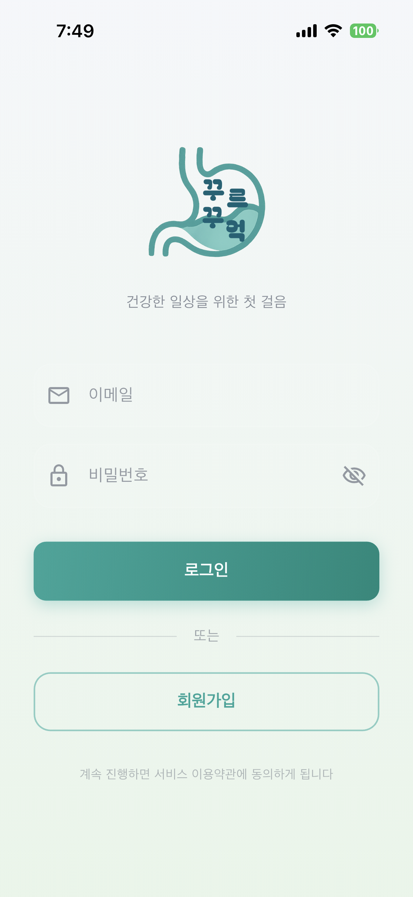
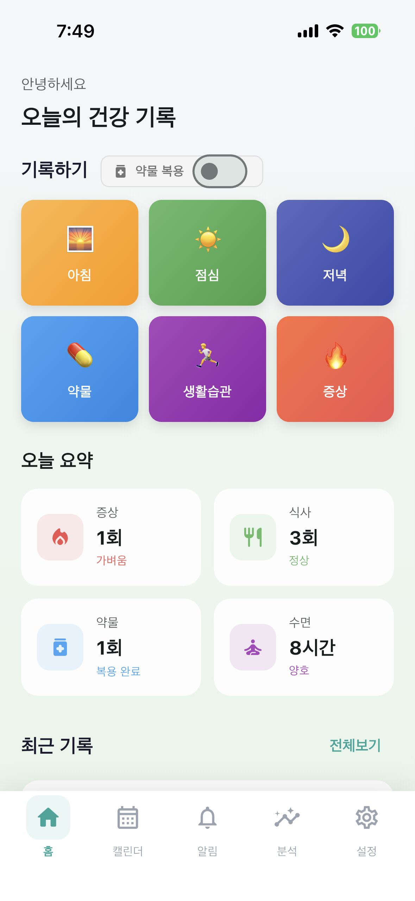
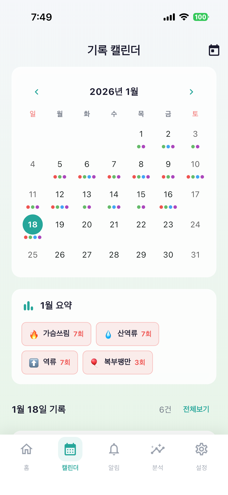
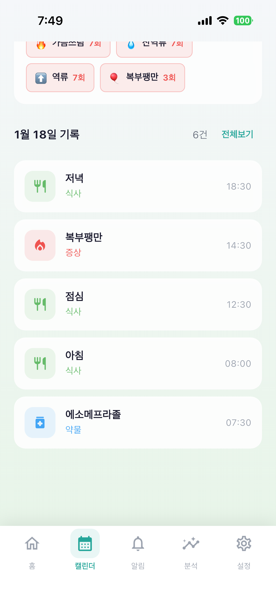
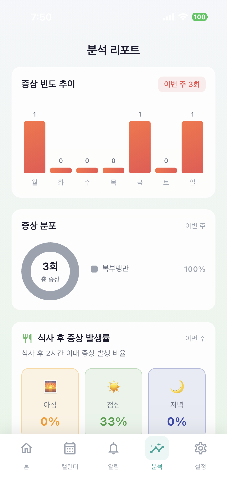
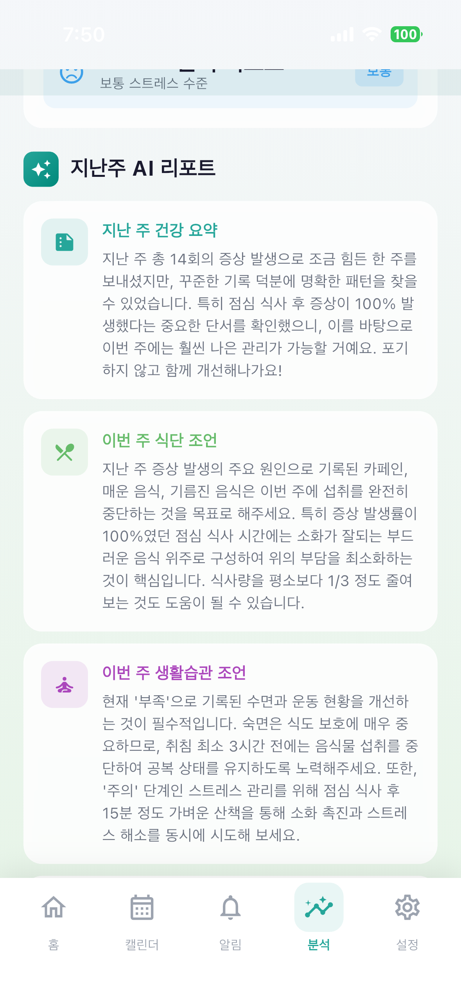
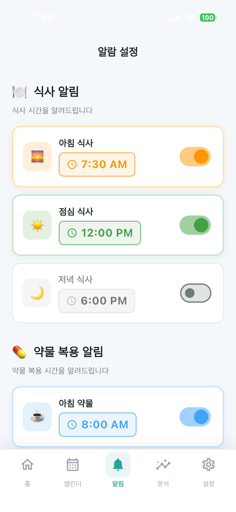
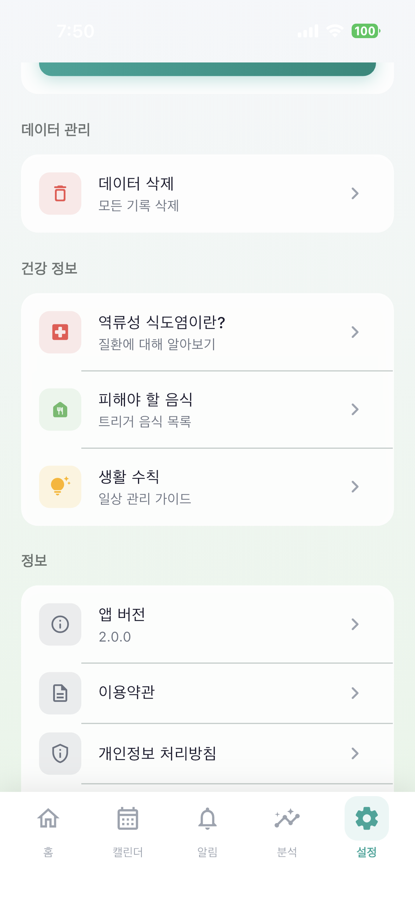

# NoGERD (꾸르꾸억)

> AI 기반 GERD(위식도역류질환) 통합 관리 앱

식단, 증상, 약물, 생활습관을 기록하고 AI가 트리거 패턴을 분석해주는 건강 관리 앱입니다.

## 다운로드

<a href="https://apps.apple.com/kr/app/%EA%BE%B8%EB%A5%B4%EA%BE%B8%EC%96%B5/id6745237684">
  
</a>

<!-- 안드로이드 출시 후 주석 해제 -->
<!--
<a href="플레이스토어_링크">
  
</a>
-->

> Android: 테스트 완료 후 출시 예정 (비공개 테스트 진행중)

## 데모 영상

<video src="screenshots/preview_movie.mp4" controls width="300"></video>

## 스크린샷

|                     로그인                     |                      홈                       |                      캘린더                       |                        기록 상세                         |
| :--------------------------------------------: | :-------------------------------------------: | :-----------------------------------------------: | :------------------------------------------------------: |
|  |  |  |  |

|                   분석 리포트                   |                      AI 분석                       |                    알람 설정                     |                       설정                       |
| :---------------------------------------------: | :------------------------------------------------: | :----------------------------------------------: | :----------------------------------------------: |
|  |  |  |  |

## 주요 기능

- **식단/증상/약물/생활습관 기록** - 아침/점심/저녁 시간대별 Upsert 방식
- **AI 트리거 분석 (Gemini)** - 식단-증상 상관관계 패턴 분석
- **데이터 시각화** - 증상 트렌드, 요일별 패턴 차트
- **오프라인 지원** - Hive(로컬) + Supabase(클라우드) 동기화
- **약 복용 알림** - 네이티브 알람 (Method Channel + AlarmManager)
- **CSV 내보내기** - 의료진 상담용 데이터 추출 (추후 구현 예정)

## 기술 스택


**Client:** Flutter, Dart, BLoC, Hive, GoRouter

**Backend:** Supabase (Auth, Database)

**AI:** Google Gemini API

## 아키텍처

- Clean Architecture + Feature-First 구조
- BLoC 패턴 (상태 관리)
- fpdart (함수형 에러 처리 - Either, Option)
- Freezed (불변 상태/이벤트 클래스)
- Injectable (의존성 주입 자동화)

## 실행 방법

```bash
# 의존성 설치
flutter pub get

# 코드 생성 (Freezed, Injectable, Hive)
flutter pub run build_runner build --delete-conflicting-outputs

# .env 파일 생성 후 API 키 입력
# SUPABASE_URL, SUPABASE_ANON_KEY, GEMINI_API_KEY

# 실행
flutter run
```

## 개발

- **개발자:** 표원식
- **개발 기간:** 2024.12 ~ 2025.01
- **1인 개발** (기획, 디자인, 개발)

## 라이선스

MIT License
